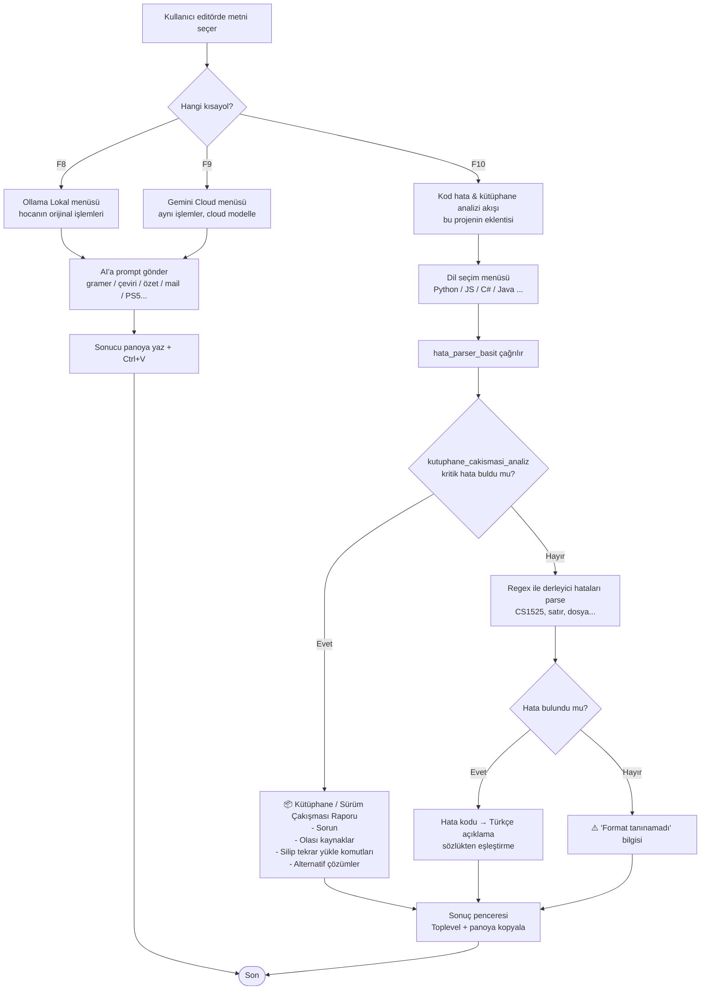

# AI Asistan — Metin İşleme & Kod Hata / Kütüphane Çakışması Analizi

Windows için sistem çapında çalışan AI destekli metin işleme, kod hata ayıklama ve
**kütüphane sürüm çakışması / eksik paket raporlama** aracı.

> Bu sürümün odak noktası: derleyici/çalışma zamanı hatalarının yanında **kritik
> bağımlılık hatalarını** (eksik modül, sürüm çakışması, peer dependency çakışması,
> NuGet/Maven/Gradle sorunları) tespit edip kullanıcıya **"silip tekrar yükle"**
> tarzı, adım adım, gerekçeli çözüm raporu üretmek.

---

## 1. Özellikler

### 1.1 Metin İşleme (F8 / F9) — Hocanın orijinal akışı
Seçili metin üzerinde AI işlemleri:

- 📝 Gramer Düzelt
- 🇬🇧 İngilizceye Çevir
- 🇹🇷 Türkçeye Çevir
- 📑 Özetle (Madde Madde)
- 💼 Daha Resmi Yap
- 🐍 Python Koduna Çevir
- 📧 Cevap Yaz (Mail)
- 🎮 PS5 Oyun Skor + Acımasız Yorum

**Kısayollar**

| Tuş | İşlev |
|-----|-------|
| `F8` | Lokal Ollama AI menüsü (hocanın orijinal metin işleme akışı) |
| `F9` | Google Cloud Gemini AI menüsü (aynı menü, cloud modelle) |
| `F10` | **Kod hata & kütüphane çakışması analizi** (bu projenin eklentisi) |

### 1.2 Kod Hata & Kütüphane Çakışması Analizi

Seçili hata metni önce **regex tabanlı yerel parser**'dan geçer:

1. **Önce** kritik kütüphane/bağımlılık hatası var mı kontrol edilir
   (eksik modül, sürüm çakışması, peer dependency, NuGet/Maven/Gradle).
2. Varsa → **detaylı "silip tekrar yükle" raporu** üretilir (AI beklemeden).
3. Yoksa → klasik derleyici hata satırları parse edilir (örn. `CS1525`, satır numarası).

**Desteklenen diller:** Python, JavaScript, TypeScript, Java, C#, C/C++, HTML/CSS,
PHP, Rust, Go.

**Örnek — Eksik Python paketi:**

```
⚠️ EKSİK / UYUMSUZ KÜTÜPHANE TESPİT EDİLDİ (Python)
============================================================

📋 SORUN:
'pandas' kütüphanesi sistemde kurulu değil, yanlış sanal ortamda
aranıyor ya da farklı bir Python sürümüne kurulmuş olabilir...

🔍 HATANIN OLASI KAYNAKLARI:
  1) Kütüphane hiç kurulmadı (pip install unutuldu).
  2) Sanal ortam (venv) aktif edilmeden program çalıştırıldı...
  3) Eski bir sürüm kuruldu; import yolu değişmiş olabilir...
  4) Başka bir kütüphaneyle sürüm çakışması var...

🛠️ ÇÖZÜM - 'SİLİP TEKRAR YÜKLE' YÖNTEMİ:
  1. .venv\Scripts\activate
  2. pip uninstall pandas -y
  3. pip cache purge
  4. pip install pandas --upgrade --no-cache-dir

🔁 ALTERNATİF ÇÖZÜMLER:
  - Tüm bağımlılıkları sıfırla ...
  - Sanal ortamı komple baştan kur ...
```

---

## 2. Proje Akış Şeması (Mermaid Flowchart)



---

## 3. Kurulum

### Gereksinimler
- Windows 10/11
- Python 3.12+
- Ollama (lokal AI için) — https://ollama.com/download
- Google Cloud hesabı (opsiyonel, F9 için)

### Adımlar

```powershell
# 1) Ollama modelini indir
ollama pull qwen2.5:0.5b

# 2) Projeyi klonla
git clone https://github.com/AlinaPavlova25/Introduction-to-Data-Visualization-Project-Assignment.git
cd Introduction-to-Data-Visualization-Project-Assignment

# 3) Başlat
.\BASLAT.bat
```

`BASLAT.bat` otomatik olarak:
- `.venv` sanal ortamı oluşturur
- `requirements.txt` paketlerini kurar
- `main.pyw` uygulamasını arka planda başlatır

### Google Cloud Gemini (Opsiyonel, F9 için)

```powershell
gcloud auth application-default login
$env:GOOGLE_CLOUD_PROJECT="proje-id"
$env:GOOGLE_CLOUD_LOCATION="global"
$env:GOOGLE_GENAI_USE_VERTEXAI="True"
```

---

## 4. Proje Yapısı

```
.
├── main.pyw              # Ana uygulama (kısayol dinleyici + GUI + analiz)
├── BASLAT.bat            # Sanal ortam kur + çalıştır
├── kurulum.bat           # Kurulum scripti
├── requirements.txt      # Python bağımlılıkları
└── README.md             # Bu dosya
```

---

## 5. Teknik Detaylar

### 5.1 Kütüphane Çakışması / Eksik Paket Dedektörü

`kutuphane_cakismasi_analiz()` fonksiyonu seçili hata metnini tarar ve
aşağıdaki kalıpları arar:

| Dil / Ekosistem | Tespit edilen durumlar |
|-----------------|------------------------|
| Python / pip    | `ModuleNotFoundError`, `ImportError`, `ResolutionImpossible`, `incompatible`, `version conflict` |
| JS / TS (npm)   | `ERESOLVE`, `peer dependency`, `conflict`, `Cannot find module`, `Module not found` |
| C# (NuGet)      | `NuGet`, `package restore`, `unable to find` |
| Java            | `Maven`, `Gradle`, `dependency` |

Eşleşme olursa `hata_parser_basit()` doğrudan bu **detaylı raporu** döndürür
ve klasik syntax parsing'e girmez.

### 5.2 Derleyici Hata Parser'ı

Kütüphane hatası yoksa şu kalıp yakalanır:

```
dosya.cs(18,8): error CS1525: Unexpected symbol `Console'
```

→ `dosya`, `satır`, `kolon`, `hata_kodu`, `mesaj` ayrıştırılır → `HATA_SOZLUKLERI`
üzerinden Türkçe açıklama aranır (örn. `CS1525` → "Noktalı virgül eksik veya
yanlış yerde").

### 5.3 AI Modelleri

| Model                       | Kullanım    | Yaklaşık süre (CPU) |
|-----------------------------|-------------|---------------------|
| `qwen2.5:0.5b`              | Lokal (F8)  | ~15 sn              |
| `gemini-3-flash-preview`    | Cloud (F9)  | ~3 sn               |

---

## 6. Kullanılan Teknolojiler

- **Python 3.12** — ana dil
- **Tkinter** — GUI (menü + sonuç pencereleri)
- **pynput** — global kısayol dinleyici (F8/F9/F10)
- **pyautogui** — klavye/mouse simülasyonu (seçim kopyalama, yapıştırma)
- **pyperclip** — pano erişimi
- **requests** — Ollama API streaming
- **google-genai** — Vertex AI / Gemini (opsiyonel)

---

## 7. Sorun Giderme

### Ollama bağlanamıyor
```powershell
ollama serve
ollama list
```

### Google Cloud 403
- Billing aktif mi?
- Vertex AI API etkin mi? (`aiplatform.googleapis.com`)
- IAM rolü `roles/aiplatform.user` verildi mi?

### Kısayol çalışmıyor
- Uygulamanın arka planda çalıştığını doğrulayın (Görev Yöneticisi → `python.exe`)
- Başka bir uygulama F8/F9/F10 tuşunu yakalıyor olabilir
- BASLAT.bat'ı yeniden çalıştırın

---

## 8. Lisans

MIT License
