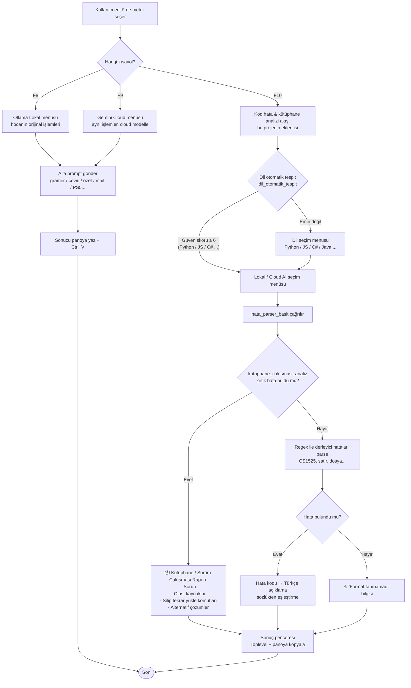

# AI Asistan — Metin İşleme & Kod Hata / Kütüphane Çakışması Analizi

Windows için sistem çapında çalışan AI destekli metin işleme, kod hata ayıklama ve
**kütüphane sürüm çakışması / eksik paket raporlama** aracı.

> Bu sürümün odak noktası: derleyici/çalışma zamanı hatalarının yanında **kritik
> bağımlılık hatalarını** (eksik modül, sürüm çakışması, peer dependency çakışması,
> NuGet/Maven/Gradle sorunları) tespit edip kullanıcıya **"silip tekrar yükle"**
> tarzı, adım adım, gerekçeli çözüm raporu üretmek.

---

## 1. Özellikler

### 1.1 Metin İşleme (F8 / F9) — Hocanın orijinal akışı
Seçili metin üzerinde AI işlemleri:

- 📝 Gramer Düzelt
- 🇬🇧 İngilizceye Çevir
- 🇹🇷 Türkçeye Çevir
- 📑 Özetle (Madde Madde)
- 💼 Daha Resmi Yap
- 🐍 Python Koduna Çevir
- 📧 Cevap Yaz (Mail)
- 🎮 PS5 Oyun Skor + Acımasız Yorum

**Kısayollar**

| Tuş | İşlev |
|-----|-------|
| `F8` | Lokal Ollama AI menüsü (hocanın orijinal metin işleme akışı) |
| `F9` | Google Cloud Gemini AI menüsü (aynı menü, cloud modelle) |
| `F10` | **Kod hata & kütüphane çakışması analizi** (bu projenin eklentisi) |

### 1.2 Kod Hata & Kütüphane Çakışması Analizi

Seçili hata metni önce **regex tabanlı yerel parser**'dan geçer:

1. **Dil otomatik tespit** edilir (`dil_otomatik_tespit`) — metindeki
   sinyallere göre (Traceback, `CS1525`, `npm ERR!`, `error[E0425]` vb.)
   skor hesaplanır, eşiği geçen dil otomatik seçilir ve dil menüsü atlanır.
   Emin değilse fallback olarak manuel dil seçim menüsü açılır.
2. **Sonra** kritik kütüphane/bağımlılık hatası var mı kontrol edilir
   (eksik modül, sürüm çakışması, peer dependency, NuGet/Maven/Gradle).
3. Varsa → **detaylı "silip tekrar yükle" raporu** üretilir (AI beklemeden).
4. Yoksa → klasik derleyici hata satırları parse edilir (örn. `CS1525`, satır numarası).

**Desteklenen diller:** Python, JavaScript, TypeScript, Java, C#, C/C++, HTML/CSS,
PHP, Rust, Go.

---

## Örnek Kullanım Galerisi

Aşağıdaki örnekler gerçek hata metinleri kullanılarak **parser fonksiyonu
doğrudan çağrılarak** üretilmiştir (bkz. tekrar üretim: bölüm 6).

### Örnek 1 — Python: Eksik Kütüphane

**Seçilen hata metni:**
```
Traceback (most recent call last):
  File "app.py", line 2, in <module>
    import pandas
ModuleNotFoundError: No module named 'pandas'
```

**F10 → Python seçildi → üretilen rapor:**
```
⚠️ EKSİK / UYUMSUZ KÜTÜPHANE TESPİT EDİLDİ (Python)
============================================================

📋 SORUN:
'pandas' kütüphanesi sistemde kurulu değil, yanlış sanal ortamda
aranıyor ya da farklı bir Python sürümüne kurulmuş olabilir. Program
çalışırken `import pandas` satırında durdu.

🔍 HATANIN OLASI KAYNAKLARI:
  1) Kütüphane hiç kurulmadı (pip install unutuldu).
  2) Sanal ortam (venv) aktif edilmeden program çalıştırıldı...
  3) Eski bir sürüm kuruldu; import yolu değişmiş olabilir
     (örn. eski 'sklearn' -> yeni 'scikit-learn').
  4) Başka bir kütüphaneyle sürüm çakışması var...

🛠️ ÇÖZÜM - 'SİLİP TEKRAR YÜKLE' YÖNTEMİ:
  1. .venv\Scripts\activate
  2. pip uninstall pandas -y
  3. pip cache purge
  4. pip install pandas --upgrade --no-cache-dir

🔁 ALTERNATİF ÇÖZÜMLER:
  - Tüm bağımlılıkları sıfırla (pip freeze + uninstall + install -r)
  - Sanal ortamı komple baştan kur (rmdir /s /q .venv + python -m venv)

💡 EK NOT:
  - where python   (hangi Python kullanılıyor?)
  - pip show pandas   (kurulu mu?)
```

### Örnek 2 — Python: Sürüm Çakışması

**Seçilen hata metni:**
```
ERROR: Cannot install -r requirements.txt because these package versions
have conflicting dependencies.
ResolutionImpossible: numpy==1.19 is incompatible with pandas>=2.0
```

**F10 → Python → üretilen rapor (özet):**
```
⚠️ KÜTÜPHANE SÜRÜM ÇAKIŞMASI TESPİT EDİLDİ (Python / pip)
============================================================
📋 SORUN: pip, tüm koşulları karşılayan bir sürüm kümesi bulamıyor.
🔍 KAYNAK: numpy<1.20 iken pandas>=2.0 isteniyor (transitive conflict).
🛠️ ÇÖZÜM:
  1. python -m pip install --upgrade pip
  2. pip freeze > requirements_backup.txt
  3. pip uninstall -r requirements_backup.txt -y
  4. pip cache purge
  5. pip install -r requirements.txt
🔁 ALTERNATİF: '==' yerine '>=' kullan, ya da temiz venv kur.
```

### Örnek 3 — Node.js: Eksik NPM Paketi

**Seçilen hata metni:**
```
Error: Cannot find module 'express'
    at Function.Module._resolveFilename
```

**F10 → JavaScript → üretilen rapor (özet):**
```
⚠️ EKSİK NPM PAKETİ TESPİT EDİLDİ
📋 SORUN: 'express' paketi node_modules'da yok.
🛠️ ÇÖZÜM:
  1. npm uninstall express
  2. npm install express --save
💡 EK NOT: Global ise → npm install -g express
```

### Örnek 4 — NPM Peer Dependency Çakışması

**Seçilen hata metni:**
```
npm ERR! ERESOLVE unable to resolve dependency tree
npm ERR! Found: react@18.0.0
npm ERR! peer dependency conflict
```

**F10 → JavaScript → üretilen rapor (özet):**
```
⚠️ NPM KÜTÜPHANE ÇAKIŞMASI TESPİT EDİLDİ
🛠️ ÇÖZÜM - SİLİP TEKRAR YÜKLE:
  1. rm -rf node_modules package-lock.json
  2. npm cache clean --force
  3. npm install
💡 Çalışmazsa: npm install --legacy-peer-deps
```

### Örnek 5 — C# NuGet Paket Sorunu

**Seçilen hata metni:**
```
error NU1101: Unable to find package Newtonsoft.Json.
No packages exist with this id in source(s): nuget.org
```

**F10 → C# → üretilen rapor (özet):**
```
⚠️ NUGET PAKET SORUNU TESPİT EDİLDİ
🛠️ ÇÖZÜM:
  1. dotnet clean
  2. rmdir /s /q bin obj
  3. dotnet restore --force
  4. dotnet build
💡 dotnet nuget locals all --clear
```

### Örnek 6 — Java Maven Bağımlılık Hatası

**Seçilen hata metni:**
```
[ERROR] Failed to execute goal on project demo: Could not resolve
dependencies for project com.example:demo:jar:1.0
```

**F10 → Java → üretilen rapor (özet):**
```
⚠️ MAVEN/GRADLE BAĞIMLILIK SORUNU TESPİT EDİLDİ
🛠️ MAVEN:
  1. mvn clean
  2. rmdir /s /q target
  3. mvn dependency:purge-local-repository
  4. mvn install
🛠️ GRADLE:
  1. gradle clean
  2. rmdir /s /q build .gradle
  3. gradle build --refresh-dependencies
```

### Örnek 7 — Kütüphane değil, saf derleyici hatası (C#)

**Seçilen hata metni:**
```
Program.cs(18,8): error CS1525: Unexpected symbol `Console'
Program.cs(33,1): error CS1002: ; expected
```

Kütüphane dedektörü eşleşmez → **syntax parser** devreye girer:

```
🌐 Dil: C#
📊 2 hata bulundu

🔴 HATA #1
📍 Program.cs - Satır 18
❌ Noktalı virgül (;) eksik veya yanlış yerde
💻 Kod: CS1525

🔴 HATA #2
📍 Program.cs - Satır 33
❌ Satır sonunda noktalı virgül (;) eksik
💻 Kod: CS1002

💡 İpucu: Belirtilen satırları kontrol edin.
```

### Örnek 8 — Python Traceback (çağrı yığınlı)

**Seçilen hata metni:**
```
Traceback (most recent call last):
  File "main.py", line 10, in <module>
    run()
  File "main.py", line 7, in run
    process(data)
  File "utils.py", line 22, in process
    return d['eksik_anahtar']
KeyError: 'eksik_anahtar'
```

Kütüphane dedektörü eşleşmez → **`python_traceback_parser`** devreye girer:

```
🌐 Dil: Python
📊 1 hata bulundu

🔴 HATA #1
📍 utils.py - Satır 22
❌ Sözlükte anahtar bulunamadı
💻 Kod: KeyError
💬 Mesaj: 'eksik_anahtar'
🧭 Çağrı yığını: main.py:10 -> main.py:7 -> utils.py:22

💡 İpucu: Belirtilen satırları kontrol edin.
```

Parser, yığındaki **en iç frame**'i (hatanın gerçek olduğu yer) ana konum
olarak alır, tüm zinciri "çağrı yığını" satırında gösterir. Sözlükte
olmayan custom hata tipleri için hata tipi + mesaj çıktıya aktarılır.

---

## 2. Proje Akış Şeması (Mermaid Flowchart)



---

## 3. Kurulum

### Gereksinimler
- Windows 10/11
- Python 3.12+
- Ollama (lokal AI için) — https://ollama.com/download
- Google Cloud hesabı (opsiyonel, F9 için)

### Adımlar

```powershell
# 1) Ollama modelini indir
ollama pull qwen2.5:0.5b

# 2) Projeyi klonla
git clone https://github.com/AlinaPavlova25/Introduction-to-Data-Visualization-Project-Assignment.git
cd Introduction-to-Data-Visualization-Project-Assignment

# 3) Başlat
.\BASLAT.bat
```

`BASLAT.bat` otomatik olarak:
- `.venv` sanal ortamı oluşturur
- `requirements.txt` paketlerini kurar
- `main.pyw` uygulamasını arka planda başlatır

### Google Cloud Gemini (Opsiyonel, F9 için)

```powershell
gcloud auth application-default login
$env:GOOGLE_CLOUD_PROJECT="proje-id"
$env:GOOGLE_CLOUD_LOCATION="global"
$env:GOOGLE_GENAI_USE_VERTEXAI="True"
```

---

## 4. Proje Yapısı

```
.
├── main.pyw              # Ana uygulama (kısayol dinleyici + GUI + analiz)
├── BASLAT.bat            # Sanal ortam kur + çalıştır
├── kurulum.bat           # Kurulum scripti
├── requirements.txt      # Python bağımlılıkları
└── README.md             # Bu dosya
```

---

## 5. Teknik Detaylar

### 5.1 Kütüphane Çakışması / Eksik Paket Dedektörü

`kutuphane_cakismasi_analiz()` fonksiyonu seçili hata metnini tarar ve
aşağıdaki kalıpları arar:

| Dil / Ekosistem | Tespit edilen durumlar |
|-----------------|------------------------|
| Python / pip    | `ModuleNotFoundError`, `ImportError`, `ResolutionImpossible`, `incompatible`, `version conflict` |
| JS / TS (npm)   | `ERESOLVE`, `peer dependency`, `conflict`, `Cannot find module`, `Module not found` |
| C# (NuGet)      | `NuGet`, `package restore`, `unable to find` |
| Java            | `Maven`, `Gradle`, `dependency` |

Eşleşme olursa `hata_parser_basit()` doğrudan bu **detaylı raporu** döndürür
ve klasik syntax parsing'e girmez.

### 5.2 Derleyici Hata Parser'ı

Kütüphane hatası yoksa şu kalıp yakalanır:

```
dosya.cs(18,8): error CS1525: Unexpected symbol `Console'
```

→ `dosya`, `satır`, `kolon`, `hata_kodu`, `mesaj` ayrıştırılır → `HATA_SOZLUKLERI`
üzerinden Türkçe açıklama aranır (örn. `CS1525` → "Noktalı virgül eksik veya
yanlış yerde").

### 5.3 AI Modelleri

| Model                       | Kullanım    | Yaklaşık süre (CPU) |
|-----------------------------|-------------|---------------------|
| `qwen2.5:0.5b`              | Lokal (F8)  | ~15 sn              |
| `gemini-3-flash-preview`    | Cloud (F9)  | ~3 sn               |

---

## 6. Kullanılan Teknolojiler

- **Python 3.12** — ana dil
- **Tkinter** — GUI (menü + sonuç pencereleri)
- **pynput** — global kısayol dinleyici (F8/F9/F10)
- **pyautogui** — klavye/mouse simülasyonu (seçim kopyalama, yapıştırma)
- **pyperclip** — pano erişimi
- **requests** — Ollama API streaming
- **google-genai** — Vertex AI / Gemini (opsiyonel)

---

## 7. Sorun Giderme

### Ollama bağlanamıyor
```powershell
ollama serve
ollama list
```

### Google Cloud 403
- Billing aktif mi?
- Vertex AI API etkin mi? (`aiplatform.googleapis.com`)
- IAM rolü `roles/aiplatform.user` verildi mi?

### Kısayol çalışmıyor
- Uygulamanın arka planda çalıştığını doğrulayın (Görev Yöneticisi → `python.exe`)
- Başka bir uygulama F8/F9/F10 tuşunu yakalıyor olabilir
- BASLAT.bat'ı yeniden çalıştırın

---

## 8. Test / Tekrar Üretim

README'deki örnek çıktıların tamamı aşağıdaki Python scripti ile doğrudan
üretilmiştir (GUI açmadan, parser fonksiyonunu doğrudan çağırarak):

```python
# test_parser.py
import importlib.util
spec = importlib.util.spec_from_file_location("m", "main.pyw")
m = importlib.util.module_from_spec(spec)
spec.loader.exec_module(m)

ornek = "ModuleNotFoundError: No module named 'pandas'"
print(m.kutuphane_cakismasi_analiz(ornek, "python"))

ornek2 = "Program.cs(18,8): error CS1525: Unexpected symbol `Console'"
print(m.hata_parser_basit(ornek2, "csharp"))
```

Çalıştır:
```powershell
.\.venv\Scripts\python.exe test_parser.py
```

Son test turunda **7/7 kütüphane senaryosu** ve C# derleyici hatası doğru
şekilde yakalandı. (Python traceback'leri için saf syntax parser kapsam
dışıdır; onun için Örnek 1'deki gibi hata kütüphane dedektörüne düşer.)

